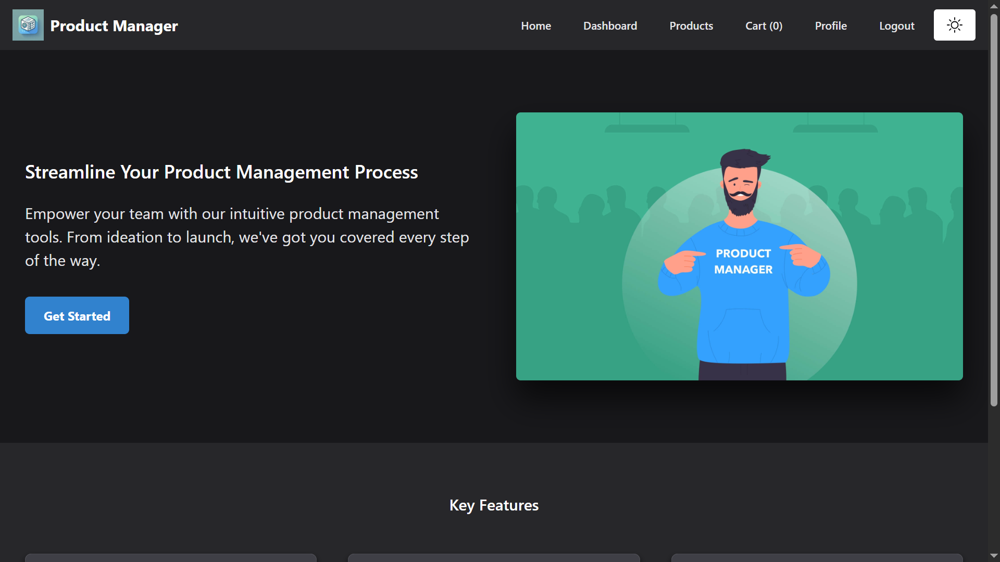
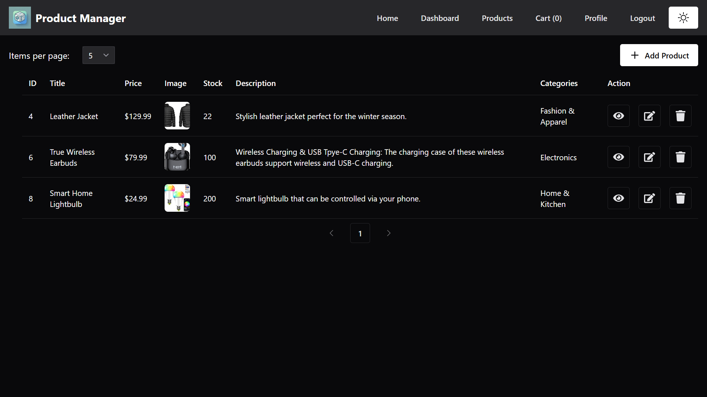
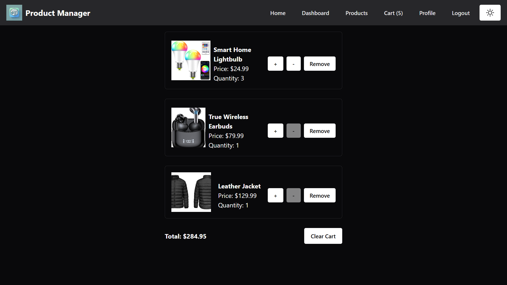
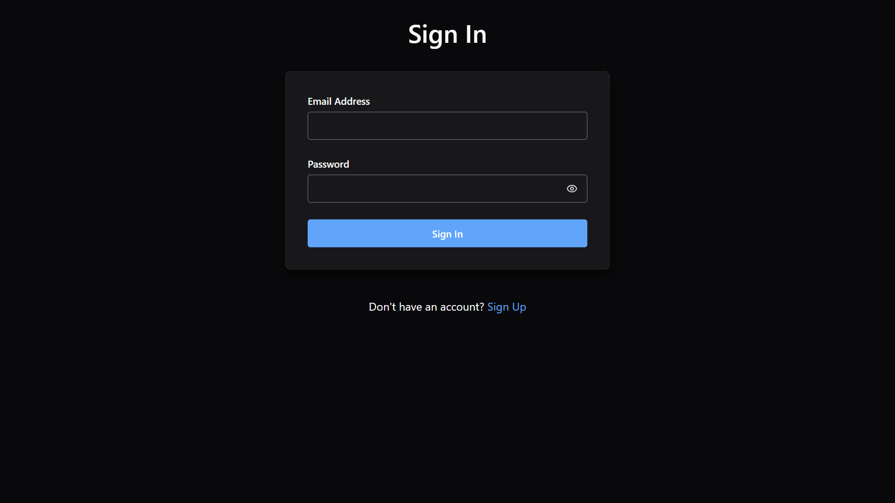
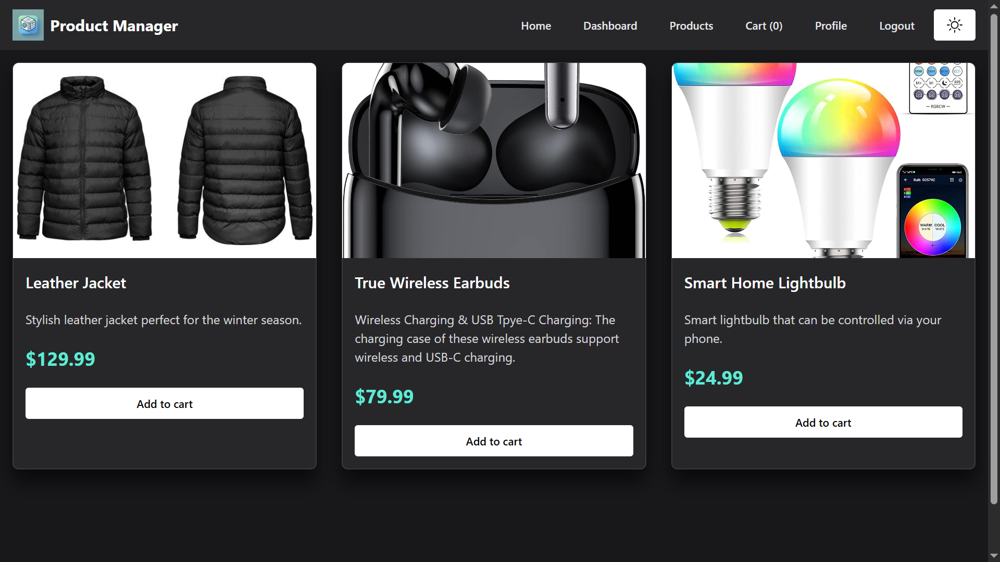

# Product Manager

A **Product Manager** application built with **React**, **Redux Toolkit**, **TypeScript**, and **Chakra UI**. This application provides a streamlined interface for managing products, user authentication, and cart functionality.

## Features

- **Authentication**: User login and signup with form validation using `yup`.
- **Product Management**: Add, edit, delete, and view products.
- **Dashboard**: Paginated product management with sorting and filtering.
- **Cart Management**: Add, update, and remove items from the cart.
- **Responsive Design**: Fully responsive UI using Chakra UI.
- **Dark Mode**: Toggle between light and dark themes.
- **File Upload**: Upload product thumbnails to the backend.
- **Persisted State**: Cart state is persisted using `redux-persist`.

## Tech Stack

- **Frontend**: React, TypeScript, Chakra UI
- **State Management**: Redux Toolkit
- **Routing**: React Router
- **Form Validation**: React Hook Form, Yup
- **API Integration**: Axios
- **Backend**: Strapi (for API and file uploads)

## Installation

1. Clone the repository:
  ```bash
  git clone https://github.com/your-username/product-manager.git
  cd product-manager
  ```

2. Install dependencies:
  ```bash
  npm install
  ```

3. Start the development server:
  ```bash
  npm run dev
  ```

4. Open the app in your browser at `http://localhost:5173`.

## Project Structure

```
src/
├── app/                # Redux slices and store
├── components/         # Reusable UI components
├── pages/              # Application pages
├── interfaces/         # TypeScript interfaces
├── validation/         # Form validation schemas
├── config/             # Axios configuration
├── data/               # Static data or helpers
├── main.tsx            # Application entry point
├── App.tsx             # Main application component
```

## Scripts

- `npm run dev`: Start the development server.
- `npm run build`: Build the application for production.
- `npm run preview`: Preview the production build.
- `npm run lint`: Run ESLint to check for code issues.

## API Endpoints

The application interacts with a Strapi backend. Below are the key endpoints:

- **Authentication**:
  - `POST /api/auth/local`: Login
  - `POST /api/auth/local/register`: Signup
- **Products**:
  - `GET /api/products`: Fetch all products
  - `POST /api/products`: Add a new product
  - `PUT /api/products/:id`: Edit a product
  - `DELETE /api/products/:id`: Delete a product
- **File Upload**:
  - `POST /api/upload`: Upload product thumbnails


## Key Components

### Authentication
- **File**: `src/pages/Auth.tsx`
- Handles user login and signup with form validation.

### Product Management
- **File**: `src/pages/dashboard/DashBoard.tsx`
- Add, edit, delete, and view products with pagination.

### Cart Management
- **File**: `src/pages/Cart.tsx`
- Add, update, and remove items from the cart.

### Profile
- **File**: `src/pages/Profile.tsx`
- Displays user information and logout functionality.

## Contributing

Contributions are welcome! Please follow these steps:

1. Fork the repository.
2. Create a new branch: `git checkout -b feature-name`.
3. Commit your changes: `git commit -m "Add feature"`.
4. Push to the branch: `git push origin feature-name`.
5. Open a pull request.

## License

This project is licensed under the MIT License. See the [LICENSE](LICENSE) file for details.

## Acknowledgments

- [React](https://reactjs.org/)
- [Redux Toolkit](https://redux-toolkit.js.org/)
- [Chakra UI](https://chakra-ui.com/)
- [Strapi](https://strapi.io/)
- [Yup](https://github.com/jquense/yup)

## Screenshots

### Home Page


### Dashboard


### Cart


### Authentication


### Products

